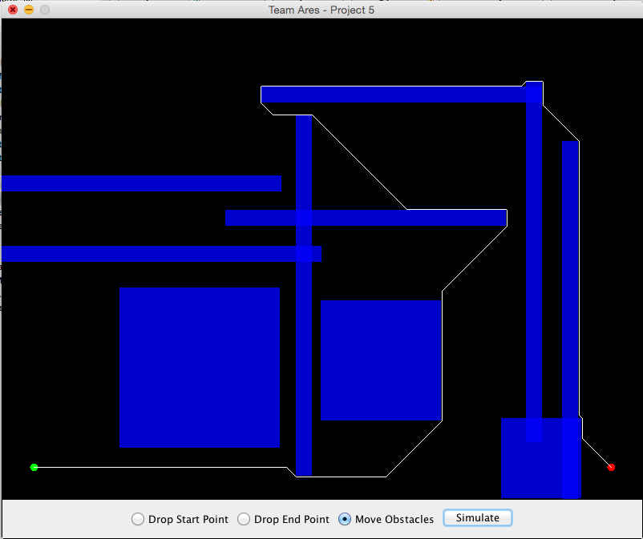
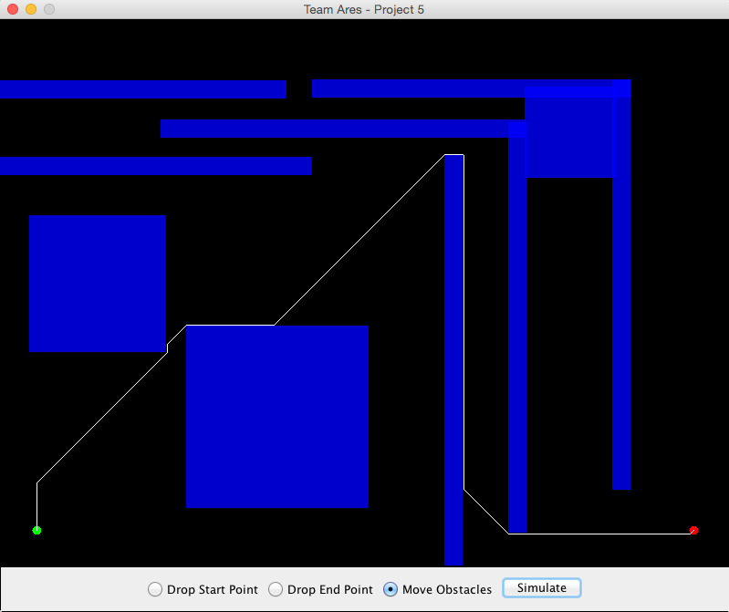
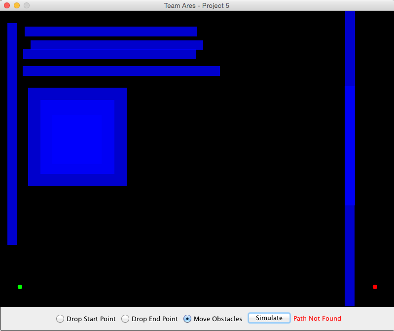

## CSCE-452-Project-5 Obstacle Navigator

## Notes
For this assignment we were tasked with creating a obstacle navigation system. We were asked to create a 500x500 px grid with three obstacles of varying sizes. The user needs the ability to change the envoirnment and simulate a valid path from a given start point to an end point. We added a few advanced features to allow our system to navigate a larger field and extra obbjets. Our implemention of path traversal is built upon a BFS algorithm that starts at the user specified start point, and visits unvisited/unobstructed points until the end point is discovered. When the end point is discovered the tree visits each parent node of visted coordinate points thus constructing the complete path.

## Compile & Run
* Clone this repo to your local development enviornment and navigate into the `src` directory.
* Type `make`
* Run with `java Main`

## Screenshots

### Example Simuations

### Ubstructed Path

