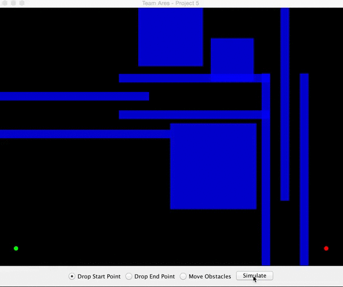

## CSCE-452-Project-5 Obstacle Navigator

## Notes
For this assignment we were tasked with creating a obstacle navigation system. We were asked to create a 500x500 pixel grid with three obstacles of varying sizes. The user needs the ability to change the environment and simulate a valid path from a given start point to an end point. We added a few advanced features to allow our system to navigate a larger field and extra objets. Our implementation of path traversal is built upon a BFS algorithm that starts at the user specified start point, and visits unvisited/unobstructed points until the end point is discovered. When the end point is discovered the tree visits each parent node of visited coordinate points thus constructing the complete path.

## Compile & Run
* Clone this repo to your local development environment and navigate into the `src` directory.
* Type `make`
* Run with `java Main`

## Screenshots

### Example Simulations

### Ubstructed Path

### License
Copyright (c) 2015 Robert Timm

Permission is hereby granted, free of charge, to any person obtaining a copy of this software and associated documentation files (the "Software"), to deal in the Software without restriction, including without limitation the rights to use, copy, modify, merge, publish, distribute, sublicense, and/or sell copies of the Software, and to permit persons to whom the Software is furnished to do so, subject to the following conditions:

The above copyright notice and this permission notice shall be included in all copies or substantial portions of the Software.

THE SOFTWARE IS PROVIDED "AS IS", WITHOUT WARRANTY OF ANY KIND, EXPRESS OR IMPLIED, INCLUDING BUT NOT LIMITED TO THE WARRANTIES OF MERCHANTABILITY, FITNESS FOR A PARTICULAR PURPOSE AND NONINFRINGEMENT. IN NO EVENT SHALL THE AUTHORS OR COPYRIGHT HOLDERS BE LIABLE FOR ANY CLAIM, DAMAGES OR OTHER LIABILITY, WHETHER IN AN ACTION OF CONTRACT, TORT OR OTHERWISE, ARISING FROM, OUT OF OR IN CONNECTION WITH THE SOFTWARE OR THE USE OR OTHER DEALINGS IN THE SOFTWARE.

